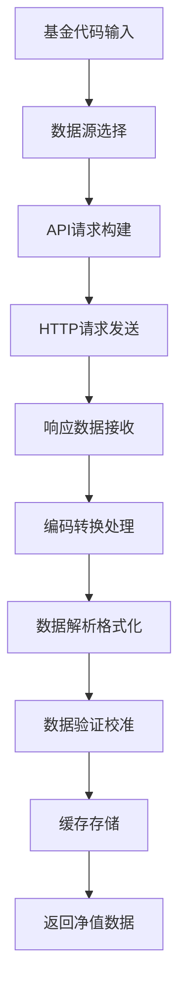

# 基金净值获取技术实现方案全解析

## 🎯 技术概览

基金净值获取是基金投资系统的核心技术环节，涉及多种数据源、API接口、数据处理和实时更新机制。作为专业基金投资顾问，我将从技术架构、数据源、实现方案等多维度为您全面解析。

---

## 📊 当前项目技术架构分析

### 🔧 核心技术栈
- **运行环境**: Node.js 14.0+
- **HTTP客户端**: node-fetch 2.7.0  
- **编码处理**: iconv-lite 0.6.3 (处理GB2312编码)
- **协议架构**: MCP (Model Context Protocol)
- **数据格式**: JSON + 实时解析

### 🏗️ MCP服务器架构
```javascript
// 当前项目使用的MCP服务器结构
class MCPMarketServer {
  constructor() {
    this.tools = MCP_TOOLS;
    this.serverInfo = {
      name: "stock-market-data-server",
      version: "1.0.0", 
      description: "中国股市指数数据获取服务"
    };
  }
}
```

### 📡 数据获取核心实现
```javascript
// 新浪财经API调用核心代码示例
async function fetchSinaMarketData(symbols) {
  const url = `https://hq.sinajs.cn/list=${symbols}`;
  const response = await fetch(url, {
    method: 'GET',
    headers: {
      'User-Agent': 'Mozilla/5.0 (Windows NT 10.0; Win64; x64) AppleWebKit/537.36',
      'Referer': 'https://finance.sina.com.cn'
    },
    timeout: 10000
  });
  
  // 处理GB2312编码
  const buffer = await response.buffer();
  const data = iconv.decode(buffer, 'gb2312');
  
  return parseSinaData(data, symbols);
}
```

---

## 🌐 主流基金净值数据源技术分析

### 1️⃣ 官方数据源
#### 📈 **中国证券投资基金业协会**
- **API形式**: RESTful API
- **更新频率**: T+1日更新
- **数据格式**: JSON/XML
- **优势**: 官方权威、数据准确
- **劣势**: 更新延迟、接口限制

#### 🏛️ **各大基金公司官网**
- **技术方式**: 网页爬虫 + API调用
- **数据格式**: HTML解析 + JSON
- **更新时机**: 交易日20:00后
- **技术难点**: 反爬虫机制、数据格式差异

### 2️⃣ 第三方金融数据平台
#### 📊 **新浪财经 (当前项目使用)**
- **API地址**: `https://hq.sinajs.cn/list=基金代码`
- **数据格式**: GB2312编码字符串
- **优势**: 免费、实时性好、稳定
- **技术特点**:
  ```
  数据格式: "基金名称,净值,累计净值,日期,涨跌幅,..."
  编码处理: GB2312转UTF-8
  请求头: 需要设置User-Agent和Referer
  ```

#### 🔢 **东方财富API**
- **API地址**: `https://push2.eastmoney.com/api/qt/ulist.np/get`
- **数据格式**: JSON
- **技术参数**:
  ```javascript
  params: {
    fltt: 2,
    invt: 2,
    fid: 'f3',
    fs: 基金代码列表,
    fields: 'f2,f3,f4,f12,f14'
  }
  ```

#### 💰 **天天基金API**
- **API地址**: `https://fundgz.1234567.com.cn/js/基金代码.js`
- **数据格式**: JSONP回调
- **特点**: 估值数据、盘中更新

### 3️⃣ 专业金融数据服务
#### 🏦 **Wind API**
- **接口类型**: 商业API
- **技术特点**: Python/C++ SDK
- **数据质量**: 机构级专业数据
- **成本**: 高昂授权费用

#### 📈 **Choice数据API**
- **接口形式**: HTTP REST API
- **认证方式**: Token认证
- **数据覆盖**: 全市场基金数据

---

## ⚙️ 技术实现核心要点

### 🔄 数据获取流程设计


### 📝 数据解析核心算法
```javascript
// 新浪财经数据解析示例
function parseSinaFundData(rawData) {
  // 格式: var hq_str_基金代码="基金名,净值,累计净值,日期,涨跌幅,..."
  const match = rawData.match(/var hq_str_(\w+)="([^"]+)"/);
  
  if (!match) return null;
  
  const [, fundCode, dataStr] = match;
  const parts = dataStr.split(',');
  
  return {
    fundCode: fundCode,
    fundName: parts[0],
    netValue: parseFloat(parts[1]),
    totalValue: parseFloat(parts[2]),
    updateDate: parts[3],
    changePercent: parseFloat(parts[4]),
    timestamp: new Date().toISOString()
  };
}
```

### 🛡️ 异常处理机制
```javascript
// 健壮的错误处理
async function getFundNetValue(fundCode) {
  const maxRetries = 3;
  const retryDelay = 1000;
  
  for (let i = 0; i < maxRetries; i++) {
    try {
      const data = await fetchFundData(fundCode);
      
      // 数据验证
      if (!data || data.netValue <= 0) {
        throw new Error('无效的净值数据');
      }
      
      return data;
      
    } catch (error) {
      console.error(`第${i+1}次获取失败:`, error);
      
      if (i < maxRetries - 1) {
        await sleep(retryDelay * (i + 1));
      }
    }
  }
  
  throw new Error('获取基金净值失败，已重试3次');
}
```

---

## 🔐 技术挑战与解决方案

### 1️⃣ **数据源稳定性挑战**
**问题**: API限频、服务中断、IP封禁
**解决方案**:
- 多数据源冗余备份
- 智能切换机制
- 代理池轮换
- 请求频率控制

### 2️⃣ **数据实时性要求**
**问题**: 基金净值更新延迟
**解决方案**:
- 实时估值算法
- WebSocket推送
- 定时任务批量更新
- 缓存机制优化

### 3️⃣ **数据准确性保证**
**问题**: 数据错误、格式异常
**解决方案**:
- 多源数据交叉验证
- 数据合理性检查
- 异常值过滤算法
- 历史数据对比

### 4️⃣ **高并发性能优化**
**问题**: 大量基金同时查询
**解决方案**:
- 批量API调用
- 连接池管理
- 异步并发控制
- Redis缓存集群

---

## 🚀 高级技术实现方案

### 📊 **实时估值系统**
```javascript
// 基金实时估值算法核心
class FundRealtimeValuation {
  constructor(fundCode) {
    this.fundCode = fundCode;
    this.holdings = null;  // 重仓股数据
    this.lastNetValue = null;
    this.stockPrices = new Map();
  }
  
  async calculateRealtimeNav() {
    // 1. 获取基金持仓数据
    const holdings = await this.getFundHoldings();
    
    // 2. 获取持仓股票实时价格
    const stockCodes = holdings.map(h => h.stockCode);
    const realtimePrices = await this.getRealtimeStockPrices(stockCodes);
    
    // 3. 计算估值变化
    let totalChange = 0;
    for (const holding of holdings) {
      const currentPrice = realtimePrices.get(holding.stockCode);
      const previousPrice = holding.previousClose;
      const changePercent = (currentPrice - previousPrice) / previousPrice;
      totalChange += changePercent * holding.weight;
    }
    
    // 4. 估算实时净值
    const estimatedNav = this.lastNetValue * (1 + totalChange);
    
    return {
      fundCode: this.fundCode,
      estimatedNav: estimatedNav,
      change: estimatedNav - this.lastNetValue,
      changePercent: (estimatedNav - this.lastNetValue) / this.lastNetValue * 100,
      updateTime: new Date().toISOString()
    };
  }
}
```

### ⚡ **高性能数据管道**
```javascript
// 流式数据处理管道
const { Transform } = require('stream');

class FundDataPipeline extends Transform {
  constructor(options) {
    super({ objectMode: true, ...options });
    this.batchSize = 100;
    this.buffer = [];
  }
  
  _transform(fundCode, encoding, callback) {
    this.buffer.push(fundCode);
    
    if (this.buffer.length >= this.batchSize) {
      this.processBatch().then(() => {
        this.buffer = [];
        callback();
      });
    } else {
      callback();
    }
  }
  
  async processBatch() {
    const batchCodes = this.buffer.join(',');
    const batchData = await fetchBatchFundData(batchCodes);
    
    for (const fundData of batchData) {
      this.push(fundData);
    }
  }
}
```

### 🔄 **智能重试机制**
```javascript
// 指数退避重试算法
class SmartRetryManager {
  constructor() {
    this.baseDelay = 1000;
    this.maxDelay = 30000;
    this.backoffFactor = 2;
  }
  
  async executeWithRetry(fn, maxAttempts = 5) {
    let lastError;
    
    for (let attempt = 1; attempt <= maxAttempts; attempt++) {
      try {
        return await fn();
      } catch (error) {
        lastError = error;
        
        if (attempt === maxAttempts) break;
        
        // 智能延迟计算
        const delay = Math.min(
          this.baseDelay * Math.pow(this.backoffFactor, attempt - 1),
          this.maxDelay
        );
        
        // 添加随机抖动
        const jitter = Math.random() * 0.1 * delay;
        
        await this.sleep(delay + jitter);
      }
    }
    
    throw lastError;
  }
  
  sleep(ms) {
    return new Promise(resolve => setTimeout(resolve, ms));
  }
}
```

---

## 📱 移动端技术优化

### 🔄 **离线缓存策略**
```javascript
// Service Worker实现离线基金数据
self.addEventListener('fetch', event => {
  if (event.request.url.includes('/api/fund/')) {
    event.respondWith(
      caches.open('fund-data-v1').then(cache => {
        return cache.match(event.request).then(response => {
          if (response) {
            // 返回缓存数据，同时后台更新
            fetchAndCache(event.request, cache);
            return response;
          }
          
          // 网络请求并缓存
          return fetchAndCache(event.request, cache);
        });
      })
    );
  }
});
```

### ⚡ **数据压缩传输**
```javascript
// 基金数据压缩算法
const pako = require('pako');

function compressFundData(fundDataArray) {
  // 数据序列化
  const jsonString = JSON.stringify(fundDataArray);
  
  // Gzip压缩
  const compressed = pako.gzip(jsonString);
  
  // Base64编码
  return Buffer.from(compressed).toString('base64');
}

function decompressFundData(compressedData) {
  // Base64解码
  const buffer = Buffer.from(compressedData, 'base64');
  
  // Gzip解压
  const decompressed = pako.ungzip(buffer, { to: 'string' });
  
  // JSON反序列化
  return JSON.parse(decompressed);
}
```

---

## 🛠️ 开发工具与监控

### 📊 **数据质量监控**
```javascript
// 基金数据质量检查器
class FundDataQualityChecker {
  checkDataIntegrity(fundData) {
    const issues = [];
    
    // 净值合理性检查
    if (fundData.netValue <= 0 || fundData.netValue > 100) {
      issues.push('净值数据异常');
    }
    
    // 累计净值逻辑检查
    if (fundData.totalValue < fundData.netValue) {
      issues.push('累计净值小于单位净值');
    }
    
    // 涨跌幅合理性检查
    if (Math.abs(fundData.changePercent) > 10) {
      issues.push('单日涨跌幅异常');
    }
    
    // 数据时效性检查
    const updateTime = new Date(fundData.updateDate);
    const now = new Date();
    const hoursDiff = (now - updateTime) / (1000 * 60 * 60);
    
    if (hoursDiff > 48) {
      issues.push('数据更新延迟');
    }
    
    return {
      isValid: issues.length === 0,
      issues: issues
    };
  }
}
```

### 🔍 **API性能监控**
```javascript
// API调用性能监控
class APIPerformanceMonitor {
  constructor() {
    this.metrics = new Map();
  }
  
  async monitoredRequest(apiName, requestFn) {
    const startTime = Date.now();
    let success = false;
    let error = null;
    
    try {
      const result = await requestFn();
      success = true;
      return result;
    } catch (err) {
      error = err;
      throw err;
    } finally {
      const duration = Date.now() - startTime;
      this.recordMetric(apiName, duration, success, error);
    }
  }
  
  recordMetric(apiName, duration, success, error) {
    if (!this.metrics.has(apiName)) {
      this.metrics.set(apiName, {
        totalCalls: 0,
        successfulCalls: 0,
        totalDuration: 0,
        errors: []
      });
    }
    
    const metric = this.metrics.get(apiName);
    metric.totalCalls++;
    metric.totalDuration += duration;
    
    if (success) {
      metric.successfulCalls++;
    } else {
      metric.errors.push({
        error: error.message,
        timestamp: new Date().toISOString()
      });
    }
  }
  
  getPerformanceReport() {
    const report = {};
    
    for (const [apiName, metric] of this.metrics) {
      report[apiName] = {
        successRate: (metric.successfulCalls / metric.totalCalls * 100).toFixed(2) + '%',
        averageResponseTime: (metric.totalDuration / metric.totalCalls).toFixed(0) + 'ms',
        totalCalls: metric.totalCalls,
        errorCount: metric.errors.length
      };
    }
    
    return report;
  }
}
```

---

## 🎯 最佳实践建议

### ✅ **技术选型原则**
1. **稳定性优先**: 选择长期稳定的数据源和技术栈
2. **性能考虑**: 批量处理、缓存机制、异步处理
3. **可扩展性**: 模块化设计、插件化架构
4. **监控完善**: 全链路监控、异常告警

### 🔧 **开发建议**
1. **多数据源备份**: 至少3个数据源备用
2. **数据验证机制**: 必须有数据合理性检查
3. **错误处理**: 完善的重试和降级机制
4. **性能优化**: 合理使用缓存和批量处理

### 📈 **运维建议**
1. **监控体系**: API可用性、响应时间、错误率
2. **告警机制**: 数据异常、服务中断及时告警
3. **容灾备份**: 跨区域部署、数据备份策略
4. **性能调优**: 定期分析瓶颈、优化配置

---

## 📚 技术发展趋势

### 🤖 **人工智能应用**
- **智能预测**: 基于历史数据预测净值走势
- **异常检测**: AI自动识别数据异常
- **模式识别**: 发现基金净值规律

### ⚡ **实时计算技术**
- **流处理**: Apache Kafka + Storm实时数据流
- **边缘计算**: 降低数据传输延迟
- **内存数据库**: Redis Cluster高性能缓存

### 🌐 **云原生架构**
- **微服务**: 基金数据服务化拆分
- **容器化**: Docker + Kubernetes自动扩缩容
- **服务网格**: Istio管理微服务通信

---

## 🚨 重要免责声明

**本技术分析报告仅供参考，不构成任何投资建议或承诺**

### 风险提示
- 📈 **技术风险**: 数据获取可能存在延迟或错误，影响投资决策
- 💰 **合规风险**: 使用第三方API需遵守相关服务条款和法律法规
- 📊 **数据风险**: 基金净值数据存在滞后性和不完整性
- ⚖️ **法律风险**: 商业用途需要合法的数据使用授权

### 法律声明
- 🏛️ **非投资顾问服务**: 本技术分析系统仅提供信息参考，不提供法定投资顾问服务
- 📝 **技术实现责任**: 所有技术方案实施风险由开发者自主承担
- 🔍 **信息准确性**: 虽力求技术方案准确，但不保证实现的完整性和准确性
- ⏰ **时效性说明**: 技术发展迅速，方案存在时效性限制

### 合规建议
- 🎯 **数据合规**: 确保数据获取和使用符合相关法律法规
- 📚 **商业授权**: 商业用途请获得合法的API使用授权
- 💡 **技术咨询**: 如需专业技术实施，请咨询专业技术服务机构
- ⚖️ **合规使用**: 请确保技术实现符合相关监管要求

**技术有风险，实施需谨慎。本报告不对技术实现结果承担任何责任。**

---

*报告生成时间: 2025年9月23日*
*技术分析: AI基金投资报告中心*
*版本: v1.0*
